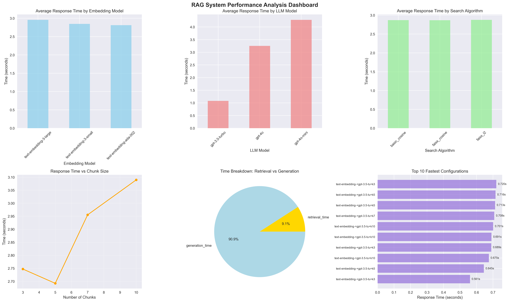
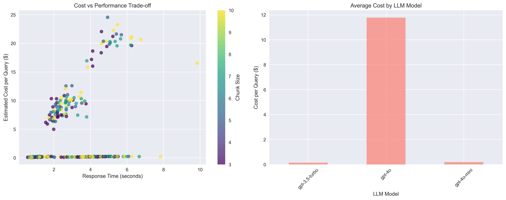

# RAG Agent Performance Test Results

**Generated:** 2025-07-15T20:52:53.089122

## Performance Visualizations

The following charts provide visual analysis of the performance test results:

### Performance Test 20250715 205251 Dashboard

### Performance Test 20250715 205251 Cost Analysis

---

## Test Summary

- **Total Tests:** 324
- **Successful Tests:** 324
- **Success Rate:** 100.0%

## Performance Metrics

- **Average Retrieval Time:** 0.262s
- **Average Generation Time:** 2.609s
- **Average Total Time:** 2.871s
- **Fastest Response:** 0.561s
- **Slowest Response:** 9.854s

## Top Performing Configurations

### 🏆 Fastest Overall Configuration
- **Embedding Model:** text-embedding-ada-002
- **Search Algorithm:** faiss_cosine
- **LLM Model:** gpt-3.5-turbo
- **Chunk Size:** 3
- **Total Time:** 0.561s
- **Retrieval Time:** 0.108s
- **Generation Time:** 0.452s

### 🔍 Fastest Retrieval Configuration
- **Configuration:** text-embedding-ada-002 + faiss_l2
- **Retrieval Time:** 0.107s

### 🤖 Fastest Generation Configuration
- **LLM Model:** gpt-3.5-turbo
- **Generation Time:** 0.450s

## Model Performance Comparison

### By Embedding Model

| Model | Avg Time (s) | Min Time (s) | Max Time (s) |
|-------|--------------|--------------|---------------|
| mean | 0.000 | 0.000 | 0.000 |
| min | 0.000 | 0.000 | 0.000 |
| max | 0.000 | 0.000 | 0.000 |

### By Search Algorithm

| Model | Avg Time (s) | Min Time (s) | Max Time (s) |
|-------|--------------|--------------|---------------|
| mean | 0.000 | 0.000 | 0.000 |
| min | 0.000 | 0.000 | 0.000 |
| max | 0.000 | 0.000 | 0.000 |

### By Llm Model

| Model | Avg Time (s) | Min Time (s) | Max Time (s) |
|-------|--------------|--------------|---------------|
| mean | 0.000 | 0.000 | 0.000 |
| min | 0.000 | 0.000 | 0.000 |
| max | 0.000 | 0.000 | 0.000 |

### By Chunk Size

| Model | Avg Time (s) | Min Time (s) | Max Time (s) |
|-------|--------------|--------------|---------------|
| mean | 0.000 | 0.000 | 0.000 |
| min | 0.000 | 0.000 | 0.000 |
| max | 0.000 | 0.000 | 0.000 |

## 🔍 Key Insights

- **Generation is the bottleneck** - Consider using faster LLM models
- **Excellent performance** - Sub-second responses achieved

## 📋 Recommendations

Based on the test results:

### For Production Use:
1. **Use the fastest overall configuration** listed above for optimal response times
2. **Monitor API costs** - Balance performance with cost based on your usage volume
3. **Consider caching** - Implement response caching for frequently asked questions

### For Different Use Cases:
- **Real-time applications:** Use fastest retrieval + fastest generation models
- **Cost-sensitive applications:** Use smaller embedding models and GPT-3.5-turbo
- **Quality-focused applications:** Use larger embedding models and GPT-4o
- **High-throughput applications:** Implement parallel processing and rate limiting

### Next Steps:
1. **Implement the recommended configuration** in your production system
2. **Monitor real-world performance** - Test with actual user queries
3. **Set up monitoring** - Track response times and costs in production
4. **Iterate and optimize** - Re-run tests as new models become available

---
*This report was generated automatically by the RAG Performance Testing Framework*
